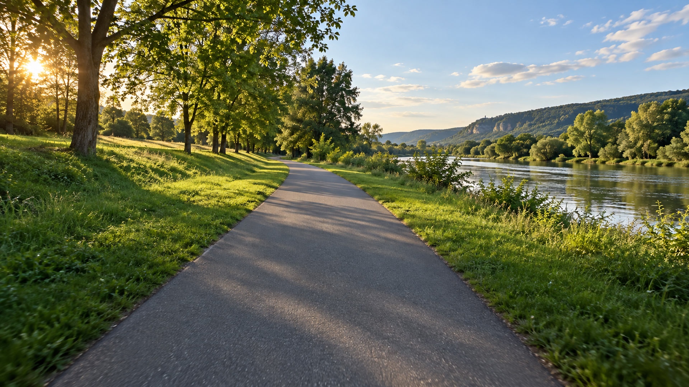
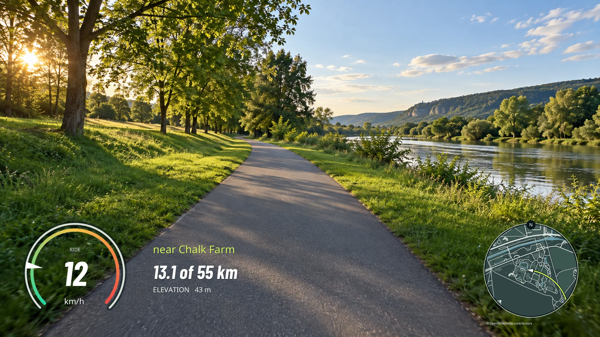

# gpx-to-video

**Fast telemetry overlays for your cycling videos.** Process action-camera footage, including 4K video, with synchronized speed, an OSM minimap, road names, elevation, and ride distance. Built in Rust with FFmpeg and hardware-accelerated encoding on macOS.

Pass a folder of videos plus a timed GPX or CSV recording. It matches each clip's capture time to your ride, draws the relevant telemetry, and saves new videos to your output folder while retaining the supported source resolution, frame rate, and codec family. Frames stream directly into the encoder without intermediate image files. For editing workflows, export a transparent overlay instead.

| Before | With the bicycle layer |
| --- | --- |
|  |  |

The landscape and telemetry above are synthetic demonstrations; the minimap and nearby place name use actual cached OpenStreetMap data around London. Repository previews use English labels. No personal recordings are included.

## Start here

You need **Rust 1.88+** and **FFmpeg 7+**, including `ffprobe`. On macOS:

```sh
brew install rust ffmpeg
git clone https://github.com/IgorShadurin/gpx-to-video.git
cd gpx-to-video
cargo install --path . --locked
```

Process all supported videos in a directory, including subdirectories:

```sh
gpx-to-video render \
  --route ride.gpx \
  --video ./camera-clips \
  --output ./finished-videos
```

Use a separate output directory. Filenames and subdirectories are retained. Originals stay in place. Existing outputs are rejected unless you deliberately pass `--overwrite`. Each result has a JSON timing/performance report and an FFmpeg log alongside it.

A `.csv` export from SpiderRoute works in the same command. A planned GPX without point timestamps cannot be synchronized.

**Defaults:** Russian labels, bicycle theme, 15 telemetry updates per second, OSM zoom 15, and a 60 km/h gauge. Coordinates are hidden; enable them in the studio or with `show_coordinates = true` in TOML. With a source video, its dimensions and constant frame rate are retained. Without a source, the canvas is 3840 × 2160, 16:9. Language: `--language en`.

## Set up the look before rendering

```sh
# Open http://127.0.0.1:8787 after this starts.
gpx-to-video view

# Or save one native 4K transparent frame with dummy data.
gpx-to-video preview --output overlay.png

# Preview actual telemetry 30 seconds into a ride.
gpx-to-video preview --route ride.csv --seconds 30 --output actual.png
```

[See the studio](docs/studio.jpg). The local **Layer studio** changes positions, sizes, colors, language, and visible elements. It draws a PNG with the same Rust renderer used for video. Add a local background image to see contrast; that image stays in your browser. Save `theme.toml`, then use it for a render:

```sh
gpx-to-video render --config theme.toml \
  --route ride.gpx --video ./camera-clips --output ./finished-videos
```

[English OSM layer, transparent 4K PNG](docs/overlay-en.png) · [Full-size English OSM composite](docs/after-en.jpg)

For every setting, generate a complete editable file:

```sh
gpx-to-video init --output bicycle.toml
```

The `[encoding]` section controls hardware bitrate scaling, software CRF/preset, WebM quality/speed and filter threads. Hardware encoding targets the original video bitrate when available; actual output size will vary.

Widget `x` and `y` are fractions of the canvas width/height; `size` is a fraction of canvas width. Invalid positions fail with an explanation. The `gauge`, `map`, and `stats` sections are independent. `[text_sizes]` lets you resize the road name, distance, elevation, coordinates and accuracy separately. See [the default configuration](examples/bicycle.toml).

`distance_decimals = 1` and `total_decimals = 0` give **13.1 из 55 км** / **13.1 of 55 km**. Whole-kilometre totals round upward so a short ride never says “0.1 of 0 km”; set `total_round_up = false` for nearest rounding. `total_km` can override the calculated track length. Colors use `#RRGGBB`; map colors are applied to vector data, so changing the palette does not trigger another download.

## Match the camera clock

```sh
gpx-to-video inspect ./camera-clips/clip.mp4

# Inspect a whole batch's matching before downloading maps or encoding.
gpx-to-video render --route ride.gpx --video ./camera-clips \
  --output ./finished-videos --dry-run
```

The tool uses the video's embedded `creation_time` (or a QuickTime creation-date tag) as its start time. **This depends on the camera clock and how the file was copied/exported.** It never substitutes a filesystem modification date. Original DJI Osmo Action 6 files are the intended workflow; actual Action 6 footage has not yet been tested. Use an original SDR recording, check its reported time against a recognizable stop/start, and correct it if needed.

```sh
# Camera clock was five seconds ahead of the GPS clock.
gpx-to-video render --route ride.gpx --video ./camera-clips \
  --output ./finished-videos --offset -5

# One file with missing or incorrect metadata.
gpx-to-video render --route ride.gpx --video clip.mp4 \
  --output ./finished-videos --start 2026-01-01T12:00:10Z
```

For separate clips or camera restarts, use a JSON manifest keyed by the relative filename:

```json
{
  "clip001.mp4": { "start": "2026-01-01T12:00:00Z" },
  "part2/clip002.mp4": {
    "start": "2026-01-01T12:05:00+00:00",
    "offset_seconds": -0.4,
    "drift_ppm": 12
  }
}
```

Pass `--timings timings.json`. The match is:

```text
GPS time = clip start + offset + video time × (1 + drift_ppm / 1,000,000)
```

Global and per-clip corrections add together. All explicit timestamps need `Z` or a numeric UTC offset. Clips with no route overlap fail before encoding. Partial coverage and GPS outages show missing values rather than invented movement.

## Export transparency only

Match a source clip, retaining its canvas and duration:

```sh
gpx-to-video render --route ride.gpx --video clip.mp4 \
  --output ./layers --overlay-only prores
```

Or supply the timing and canvas yourself:

```sh
gpx-to-video render --route ride.csv --output ./layers \
  --overlay-only webm --start 2026-01-01T12:00:10Z --duration 20
```

- **ProRes 4444 `.mov`**: an editing-friendly alpha layer, larger files.
- **VP9 alpha `.webm`**: smaller delivery, decoded alpha support varies between editors. In FFmpeg, use the `libvpx-vp9` decoder to read its alpha channel.
- **PNG preview**: full-resolution transparency, no video encoding.

Set `width`, `height`, and `overlay_fps` in TOML for custom output. Source video dimensions take precedence when a video is supplied. The transparent layer updates at `overlay_fps`; the final composited source keeps its original constant frame rate.

## Maps and place names

The circular map is drawn from OSM roads, buildings, parks, waterways, and place nodes. It uses a dark, high-contrast palette and a north-up view with a heading arrow. OSM attribution remains visible.

Required map cells are fetched through Overpass and cached as raw vector geometry under the operating system's cache directory in `gpx-to-video/osm-v1/<zoom>/<x>/<y>.json`. macOS uses `~/Library/Caches/gpx-to-video`. Use `--cache ./map-cache` to choose another location.

- Repeat renders reuse saved cells, including after restarting the program. `--offline` prohibits downloading missing cells.
- Geometry and raster caches in memory are bounded to 18 cells each. Only the selected clips' time ranges are prepared, not the entire ride when rendering one clip.
- Requests are sequential, with a pause and bounded retries. Partial downloads survive a later network error. The default download cap is 128 cells; long trips can raise `max_download_tiles` explicitly or supply a regional export using `--osm-data region.json`.
- `region.json` uses Overpass JSON with `elements`, `tags`, and `geometry` (`out tags geom`). Include the complete visible area. Large region imports are held in memory; cell caching is preferable for very large datasets.
- `overpass_url` is configurable. Public servers can be slow or unavailable. Network activity sends map bounding boxes to that endpoint; footage and telemetry files are never uploaded.
- Cached snapshots have no automatic expiry. Remove a selected cache folder when you intentionally want fresh data.
- No bulk downloads from the public OSM raster tile server are used. See [Overpass instances](https://wiki.openstreetmap.org/wiki/Overpass_API#Public_Overpass_API_instances) and [OSM attribution](https://www.openstreetmap.org/copyright).

Road labels use the closest named road within `road_snap_m` (30 m). A nearby place node is the fallback, prefixed **окр.** / **near** because a nearest settlement is not proof of an administrative boundary. This is a proximity estimate, not navigation-grade map matching. Names prefer `name:ru` / `name:en`, fall back to the local name, abbreviate common terms, and truncate safely at a character boundary. Distance limits and text fitting prevent distant or oversized labels.

## What happens to the video?

Drawing pixels into a video requires re-encoding. The default burn-in preserves the **H.264 or HEVC codec family**, canvas, constant frame rate, and 8/10-bit 4:2:0 precision. Audio streams are copied. It is not a bit-for-bit copy of the original video.

macOS uses VideoToolbox encoding; `--software` selects x264/x265. Linux and Windows use the software path by default. Those platforms are designed for portability but have not been tested yet.

HDR/PQ/HLG burn-in, rotated sources, and variable/ambiguous frame rates are rejected rather than silently converted. For **D-Log M**, set `--color-mode log`; use `--overlay-only prores` and composite after grading in your editor. D-Log M is not reliably identifiable from generic MP4 metadata, so the caller must identify it. Separate alpha exports work independently of the source's video codec/color mode.

Data/subtitle tracks and camera-specific metadata streams are not copied; this output is a viewing/editing deliverable. Keep the camera originals as the archive.

## Speed and correctness

Rust does timestamp lookup with a binary search and caches font glyphs, the gauge face, and map rasters. It draws only the rectangular region containing the enabled widgets. Frames are streamed into FFmpeg; there is no folder of intermediate frames or growing frame queue. The source video is decoded once during encoding. A configurable 15 Hz layer avoids repainting all graphics at 60 Hz.

On the tested Apple Silicon Mac, synthetic four-second 4K clips rendered at about **1.1–1.4× real time**, including FFmpeg startup. This is a short-fixture measurement, not a guarantee for every camera, disk, or color format. See [measured results](docs/media-validation.json) and [validation details](docs/validation.md).

Speed uses the recorded measurement when present. Between valid nearby points, position and speed are interpolated. Generic GPX files without speed can use a distance/time estimate. An explicitly invalid speed remains missing. No interpolation crosses track segments or the default five-second sampling gap. Distance sums valid adjacent coordinates without connecting those gaps; it can differ from another app's filtered distance.

## Development

```sh
cargo fmt --check
cargo clippy --all-targets -- -D warnings
cargo test
cargo build --release
python3 scripts/smoke-test.py
python3 scripts/check-public-content.py
```

The smoke test creates disposable synthetic 4K files and checks codec, dimensions, timestamps, compressed audio, both alpha codecs, and failure cases. It does not use personal footage. CI runs Rust checks on macOS; media tests are explicit local checks because FFmpeg encoder availability differs.

Modules and visual iteration instructions live in [AGENTS.md](AGENTS.md). [Русская памятка](docs/ru.md).

Code: MIT. Bundled fonts: SIL Open Font License. Map data: © OpenStreetMap contributors, ODbL. [Asset sources and generation prompt](assets/README.md).
